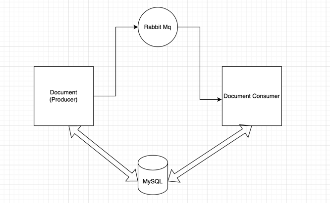

This project was done as a part of the coding challenge for PowerLedger. Its split into two spring-boot projects.
`DocumentPublisher` has the specified endpoints, while the one  named `DocumentConsumer` has the appropriate functionality of processing the documents.

## Requirements
Requirements for running this project
- [Mysql Client](https://dev.mysql.com/doc/refman/8.0/en/mysql.html)
-  JDK 11
- Docker and docker-compose

## Infrastructure

To spin up the infrastructure for this project. First, cd into the `DocumentPublisher` folder.
run the command below

    docker-compose-up

To perform the necessary migrations please cd into the  `DocumentPublisher` folder and run

    ./gradlew migrate
This will create the required infrastructure for this project.

## Running The Project

**The infrastructure has to be up in order to run this project.**
To run the entire project we need to run two applications. 

First cd into the `documents` folder and run

    ./gradlew install
    ./gradlew bootRun 

then open up another terminal cd into the `DocumentConsumer` directory and run

    ./gradlew install
    ./gradlew bootRun

if everything ends with no system specific error then the user should be able to consume the `/document` and `document/{id}/count` apis using the URLS `localhost:8080/document` and `localhost:8080/document/{id}/count`

## Running tests
Running the below command from the folders `DocumentPublisher` and `DocumentConsumer` will run all the tests

    ./gradlew test

## API Specs
The api specifications for the `/documents` api is given below

    { 
	    fileContent: String,
	    fileName: String,
	    extension: String(only txt|docx|word) are allowed
	}
For the `/documents/{id}/count`, the pathvariable `id` needs to be an integer.

## Architechture

This project was split up into two applications with a view of scaling these two services on a need basis. Justification for the technical stack is given below.

`MySQL`: I used mysql because I had experience in this stack. Probably using a NoSQL
database would have been better since there is not much relation between the data stored in this database.

`RabbitMQ`: Since this project is a POC I decided to use RabbitMQ as it is lightweight. Whereas something like apache kafka for processing this small amount of data would be overkill in my opinion. If the data volume increases we can then opt for a kafka oriented solution. For RabbitMQ I used a direct exchange and kept the same routing key for both producer and consumer as there is only one consumer in the current system and we only want the documentConsumer to consume these events.

## Workflow

In this application the workflow works like below

- The user uses the `/documents` api to save the document in the
  `document` table. Before saving the file content, some validations are done on the extension, file content and file name. Relevant code can be traced from `DocumentController.java`.
- Then a message is published a rabbitmq queue to  publish the
  documents content and the saved document's id. Code in `DocumentService.java` and `DocumentPublisher.java`.
- This message is consumed in the `DocumentConsumer`. The consumer
  then calculates the number of unique substrings from the message
  and saves it in the `processed_document` table along with the unique substring count. Relevant code in `DocumentConsumer` repo's `RabbitMQListener.java`  and `DocumentProcessingService.java`.
- If for some reason the consumer fails to save the processed document relevant data is stored into the `failed_document` table. Code in `DocumentProcessingService.java`
- A scheduled task runs every 60 minutes to check the failed document table and tries to process them again. Related code in `FailedDocumentProcessingService.java`.
